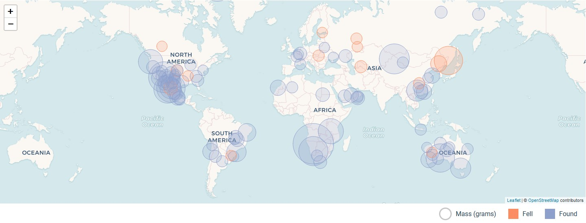

## Meteorite Landings

### Welcome to Meteorite Landings

The application is a tool that allows you to visualize on a map, data on the known landings of meteorites exported from a dataset of The Meteoritical Society.

### Functionality

On the landing page you can find a map with 100 circles and a list of 100 cards.
On the map there are circles of different sizes, the radius is in relation to the mass in grams of the meteorite, clicking on the circles displays its name and mass.
On the Cards you can find the name, classification, mass and date of discovery

### Acknowledgments

- I use [React.js](https://reactjs.org/) for the templating, DOM manipulation.
- [Create react app](https://create-react-app.dev/) for the scaffolding and building.
- I use [Figma](https://www.figma.com) to design the project.
- [Leaflet.js](https://leafletjs.com/) and [React Leaflet](https://react-leaflet.js.org/) were necessary to be able to implement the map and to be able to place the circles.
- [d3-array](https://github.com/d3/d3-array) library were used in order to manipulate the dataset.
- [d3-scale](https://github.com/d3/d3-scale) library were used to better visualize and control the radius in the map.
- [Netlify](https://www.netlify.com) for the production deployment.
